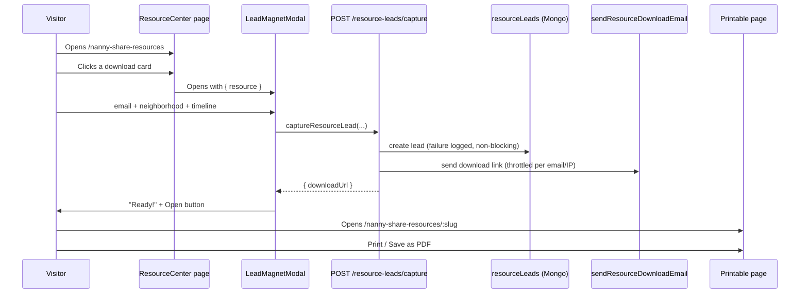

# Nanny Share Resource Center — Implementation Notes

Implements **Category 4.2 ("The Nanny Share Resource Center")** from the *Famlink Tactical Operations Manual*. This document explains what was built, how each part works, and what was deliberately left out.

- **Date:** 2026-07-18 (4.2), 2026-07-19 (4.1 + SEO)
- **Scope built:** Category 4.2 (Resource Center + lead capture) and Category 4.1 (programmatic city/neighborhood pages + live map)
- **Scope declined:** Category 3 (see below)

---

## 1. What was requested vs. what was done

The ops manual defined several categories. This pass covers the SEO/lead-capture growth work.

| Category | Status | Notes |
|---|---|---|
| 2 — Slack Lead Hub | Out of scope | Excluded by request. |
| 3 — Nanny Lane Competitor Automation | **Declined** | Not built. See §2. |
| 4.1 — Programmatic zip-code pages + map | **Built** | `/nanny-share/:city` now handles city AND neighborhood slugs and embeds a **Leaflet + OpenStreetMap** coverage map. See §8. |
| 4.2 — Resource Center + lead magnets | **Built** | See §3–§4. |

---

## 2. Category 3 — why it was declined

The "Nanny Lane Competitor Automation" was **not** implemented. Its design is inseparable from behavior that can't be built responsibly:

- **Auth bypass** — injects an active `session_token` cookie to get past a competitor's login.
- **Scraping personal data** — harvests real parents' profiles from another platform without consent.
- **Deceptive messaging** — the "double-blind" script poses as a fellow parent, hiding commercial intent until "trust is established."
- **Detection evasion** — `headless: false` + randomized delays specifically to avoid anti-bot measures.

Beyond the ethics, it creates real legal exposure for Famlink (unauthorized-access/CFAA-style claims, ToS breach, anti-spam law, data-protection from scraping PII).

**Compliant alternatives** for the same goal: official partnership/referral programs, opt-in outreach, and paid acquisition channels.

---

## 3. Category 4.2 — Resource Center (what was built)

A public, top-of-funnel hub that captures "research phase" visitors with free lead magnets, in exchange for their email + neighborhood + care timeline. Those leads are stored and intended to feed a drip-email matching sequence.

### 3.1 The three lead magnets

1. **Nanny Share Cost Calculator** — an *interactive tool* (the existing `CostEstimation` component), embedded directly on the hub. No gate — it's the hook.
2. **Nanny Share Agreement Template** — a *gated download*. Opens the email-capture modal, then reveals a printable, ready-to-fill agreement.
3. **Nanny Share Payroll & Tax Guide** — a *gated download*. Same capture flow, printable plain-English guide.

### 3.2 End-to-end data flow



Key principle: **the download is never actually blocked.** The visitor gave their details, so they always get the resource, even if the DB save or the email send fails (both are logged and swallowed). The email is a courtesy copy, not the gate. This mirrors the existing waitlist behavior.

---

## 4. How each piece works

### 4.1 Backend

#### `backend/Schema/resourceLead.js`
Mongoose model `resourceLeads`. Fields: `email` (indexed), `name`, `neighborhood`, `careTimeline`, `resource` (slug), `createdAt`. Kept **separate** from `Schema/lead.js` (the Slack-scraper leads, which are constrained to sources like FB/Nextdoor) because these are first-party, consented, inbound leads.

#### `backend/Controllers/resourceLead.controller.js`
Exports `captureResourceLead(req, res)`:
- Validates the email with a regex; rejects unknown `resource` slugs against a server-side `RESOURCES` catalog (so we only ever mail links we recognize).
- Builds an absolute `downloadUrl` from `APP_URL` + the resource's frontend path.
- Saves the lead (failure logged, non-blocking).
- Sends the email, **throttled in memory** two ways — one copy per `(email, resource)` per hour, and a per-IP cap — the same disposable-state pattern as `Routes/waitlist.js`. On send failure the throttle slot is released so it stays retryable.
- Always returns `{ downloadUrl }` so the frontend can reveal the download immediately.

#### `backend/Routes/resourceLead.routes.js`
One public route: `POST /capture` → `captureResourceLead`. Mounted in `backend/Routes/index.js` as `/resource-leads`.

#### `backend/Services/email/email.js` → `sendResourceDownloadEmail`
New send function (template **18**) following the existing `sendTemplateEmail` pattern. Automated voice; passes `first_name` (falls back to "there"), `resource_title`, `download_url`, and a `find_share_url` CTA.

#### `backend/Automated Emails/18_resource_download.html`
The email template, styled to match the house style (same as template 14, the waitlist email). Uses `{{ token }}` substitution; includes the standard signed unsubscribe / terms / contact footer links.

### 4.2 Frontend

#### `frontend/src/Config/resourceLead.js`
`captureResourceLead({ email, name, neighborhood, careTimeline, resource })` — posts to `/resource-leads/capture` via the shared axios `api`. Never throws; returns `{ ok, downloadUrl }` so the modal drives its own UI (mirrors `Config/waitlistEmail.js`).

#### `frontend/src/NewComponents/ResourceCenter/resourcesData.js`
The single source of truth for the three cards (slug, type `tool`/`download`, icon, copy, accent colors) plus the `CARE_TIMELINE_OPTIONS` used by the form.

#### `frontend/src/NewComponents/ResourceCenter/ResourceCenter.jsx`
The hub page. Renders its own `Header` + `Footer` (it's registered in the layout's `withNothing` list, so `pageLayout` adds no chrome). Sections: hero → resource cards → embedded `CostEstimation` calculator (`#calculator` anchor) → "how it works" → reused `FAQ`. A `tool` card scrolls to the calculator; a `download` card opens the modal. Includes `SEOMetaData` (title, description, canonical).

#### `frontend/src/NewComponents/ResourceCenter/LeadMagnetModal.jsx`
Reusable email-capture gate. Collects email (required) + name/neighborhood/timeline (optional). On submit it calls the config helper; on success it swaps to a "your download is ready" state with an **Open** button (opens the printable page) and a note that a copy was emailed. Uses the shared `Button` and antd `Input`/`Select`, and `fireToastMessage` for errors.

#### `frontend/src/NewComponents/ResourceCenter/ResourceDownloadPage.jsx`
The printable document wrapper for `/nanny-share-resources/:slug`. Maps the slug to a content component (unknown slug → redirect to the hub). Renders a print-friendly "document sheet" with a sticky toolbar (Back + **Print / Save as PDF**) that is hidden in print via `@media print`. All document styling lives here as shared `.doc-*` classes.

#### `frontend/src/NewComponents/ResourceCenter/content/NannyShareAgreement.jsx`
The agreement content: 13 fill-in sections (parties, term, schedule, compensation & cost split, overtime, guaranteed hours, PTO, taxes, expenses, house rules/safety, termination, confidentiality, signatures) with underlined blanks and a **"not legal advice"** disclaimer.

#### `frontend/src/NewComponents/ResourceCenter/content/PayrollTaxGuide.jsx`
The payroll/tax guide: household-employer basics, per-family employer setup in a share, setup checklist (EIN/I-9/W-4/workers' comp), what to withhold, pay schedule, year-end forms (W-2/Schedule H), fair cost-splitting, payroll services, and a checklist. Deliberately avoids hard-coded dollar thresholds (they change yearly) and carries a **"not tax advice"** disclaimer.

### 4.3 Routing & layout

- **`frontend/src/App.jsx`** — added two public routes, placed outside the logged-out-only block (like `/resources`) so they resolve for everyone and for the emailed link:
  - `/nanny-share-resources` → `ResourceCenter`
  - `/nanny-share-resources/:slug` → `ResourceDownloadPage`
- **`frontend/src/pageLayout.jsx`** — added both paths to `withNothing` so each page renders its own chrome (hub: header+footer; download: print toolbar).

---

## 5. Full file manifest

**Added**
```
backend/Schema/resourceLead.js
backend/Controllers/resourceLead.controller.js
backend/Routes/resourceLead.routes.js
backend/Automated Emails/18_resource_download.html
frontend/src/Config/resourceLead.js
frontend/src/NewComponents/ResourceCenter/resourcesData.js
frontend/src/NewComponents/ResourceCenter/ResourceCenter.jsx
frontend/src/NewComponents/ResourceCenter/LeadMagnetModal.jsx
frontend/src/NewComponents/ResourceCenter/ResourceDownloadPage.jsx
frontend/src/NewComponents/ResourceCenter/content/NannyShareAgreement.jsx
frontend/src/NewComponents/ResourceCenter/content/PayrollTaxGuide.jsx
```

**Modified**
```
backend/Routes/index.js              # mount /resource-leads
backend/Services/email/email.js      # sendResourceDownloadEmail (template 18)
frontend/src/App.jsx                 # two new routes
frontend/src/pageLayout.jsx          # withNothing entries
```

---

## 6. Verification status

- ✅ **Frontend production build passes** (`vite build`) — all imports resolve, JSX compiles.
- ✅ **Backend files pass `node --check`.**
- ⚠️ **Capture flow not run end-to-end** — the backend has no local `node_modules` and needs MongoDB + SMTP creds. Smoke-test on staging: submit the modal, confirm a `resourceLeads` doc is written and the download email arrives.
- ℹ️ Lint warnings on the new files (unescaped apostrophes, unused `React`, missing prop-types) match existing repo conventions (`CostEstimation`, `Waitlist` trigger the same) and are non-blocking.

---

## 6a. SEO

- **`SEOMetaData` on every page** — the shared component (`NewComponents/SEOMetaData.jsx`) now emits Open Graph + Twitter Card tags, an explicit `robots` directive, and a default share image (`social-preview-v2.png`). The Resource Center hub and both downloads set unique titles/descriptions/canonicals; the downloads and blog articles are typed `article`.
- **Coverage audit** — added `SEOMetaData` to the pages that were still missing it: `/find-nanny-share` (`NannyShareMatchForm.jsx`), `/waitlist` (`Waitlist.jsx`), `/caregiver/nannyshare` (`ChooseNannyShare.jsx`), each with a keyworded title/description + canonical. The individual profile view (`Search/ViewProfile.jsx`) got `SEOMetaData` with `noIndex` (dynamic + privacy-sensitive). All other public routed pages already had it.
- **`sitemap.xml`** (`frontend/public/sitemap.xml`) — lists all indexable marketing URLs: core landing pages, the Resource Center hub + both downloads, the blog list + static articles, and the city pages. Referenced from `robots.txt`.
- **`robots.txt`** (`frontend/public/robots.txt`) — allows crawling, disallows private app/auth paths (`/dashboard`, `/login`, etc.), and points to the sitemap.
- **Canonical domain** — standardized on non-www **`famlink.care`** to match the site's existing `index.html`/sitemap. (Backend `APP_URL` still defaults to `www.` for email links; make sure one 301-redirects to the other in DNS/host config.)
- Vercel serves the static `sitemap.xml`/`robots.txt` before the SPA catch-all rewrite, so both resolve at the domain root.

## 7. Caveats & follow-ups

- **Legal/tax content** carries disclaimers, but have a professional review the agreement and guide before promoting them.
- **`APP_URL`** must be set in the backend env so emailed download links are absolute/correct in production.
- **Discoverability** — the hub is linked from the shared landing header (a **Resources** dropdown with *Resource Center* + *Blog*, in `NewComponents/Header.jsx`) and the footer LINKS column (`NewComponents/Footer/Footer.jsx`). The Resource Center page itself now uses that landing header (For Families / For Caregivers / Log in / Join now) instead of the dashboard navbar.
- **Drip sequence** — leads are captured and stored, but wiring them into an actual drip/matching email sequence is a separate follow-up.

---

## 8. Category 4.1 — Programmatic city/neighborhood pages + live map

The existing `/nanny-share/:city` route now serves as the programmatic landing page for **both** cities (`oakland-ca`) and neighborhoods (`rockridge`), and embeds a live coverage map.

### 8.1 The map (`NewComponents/NannyShare/Search/NannyShareMap.jsx`)
- **Leaflet + OpenStreetMap** (free, no API key). Uses `CircleMarker`s (not default `Marker`s) so there are no bundler icon-asset issues.
- Fetches approximate pins from `GET /location/map-pins?lat=&lng=&radius=` and renders families (blue) and caregivers (green), a soft coverage ring, a counts card (top-right, clear of the zoom control), and a legend.
- **Presentation:** the map section sits on the beige brand background (`#F6F3EE`) like the other content sections, with the conversion-barrier rendered as a white card for contrast (`MapSection` in `NannyShareCityPage.jsx`).
- **Z-index containment:** the map wrapper uses `isolation: isolate` so Leaflet's internal pane/control z-indexes (up to ~1000) can't paint over the fixed header (z-50) or the page's SVG curves.

### 8.1a City hero image
The shared city hero (`Search/Hero.jsx`) picks a location-appropriate photo: the **San Francisco bridge** (`SFImage.png`) on the SF page, and a generic **nanny-share match photo** (`/nannyshareMatches.jpg`) on every other neighborhood. Oakland is unaffected — it renders through its own `HeroOakland` component and never reaches this hero.

### 8.2 Privacy — approximate + consented only
- Pins come **only** from real registered users (`type` Parents/Nanny) with a saved location — never scraped data.
- The backend (`Controllers/mapPins.controller.js`) **fuzzes** each coordinate by ~600–700 m, and the offset is **seeded from the user id** so it's stable across requests (you can't average many requests to triangulate a real home). The response contains **no** name, id, address, or contact — just `{ lat, lng, type }` + counts.

### 8.3 Conversion barrier (register gate)
Per the ops manual, the gated actions — see exact locations, contact a lead, add your own pin — require an account. Logged-out visitors see approximate pins plus a CTA card ("Sign up free to see who's really near you", "Add your pin" → `/find-nanny-share`, "Sign up free" → `/joinNow`). Pin popups also prompt sign-up.

### 8.4 Geo lookup (`Config/cityGeo.js`)
Maps a slug → `{ lat, lng, zoom, label, radius }` for East Bay cities + neighborhoods, with a service-area default for unlisted slugs (keeps the slug's formatted name as the label). Also fixes slug→name formatting so single-segment neighborhood slugs render correctly.

### 8.5 Files (4.1)
**Added:** `backend/Controllers/mapPins.controller.js`, `frontend/src/Config/cityGeo.js`, `frontend/src/NewComponents/NannyShare/Search/NannyShareMap.jsx`
**Modified:** `backend/Routes/location.js` (mount `GET /map-pins`), `frontend/src/NewComponents/NannyShare/Search/NannyShareCityPage.jsx` (slug handling + embed map), `frontend/package.json` (leaflet, react-leaflet)

### 8.6 Verification (4.1)
- ✅ Frontend build passes; backend files pass `node --check`.
- ⚠️ The map's pins need a running backend + MongoDB with real user locations to display; the endpoint relies on the existing `location` 2dsphere index. Not driven end-to-end locally (no DB). With zero nearby users the map still renders and shows a "be one of the first" message.
- ⚠️ Map **rendering** not visually confirmed (no browser here). Leaflet's common pitfalls are handled: CSS imported, CircleMarker (no icon assets), sized container, React 18-compatible `react-leaflet@4`.
